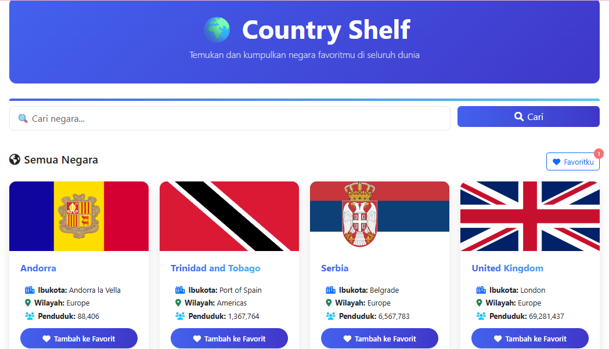
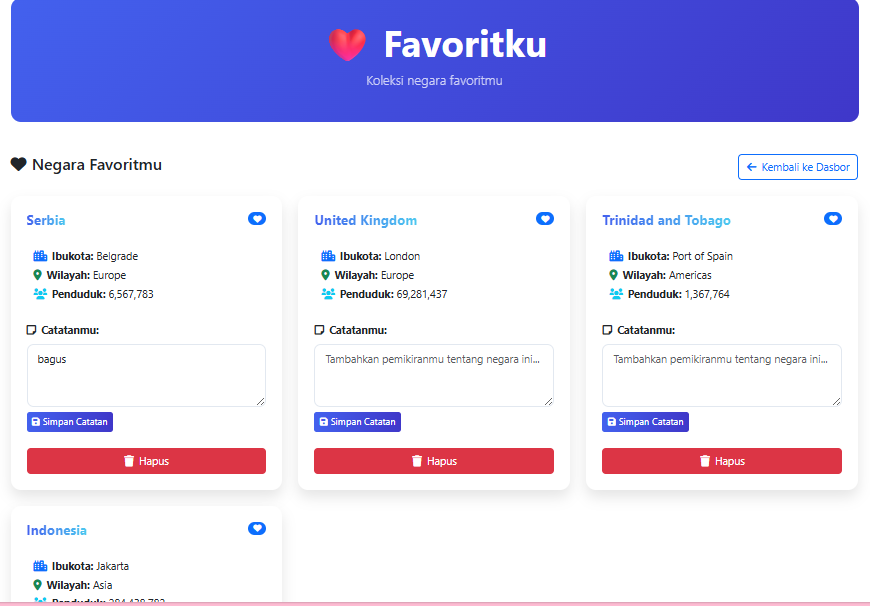
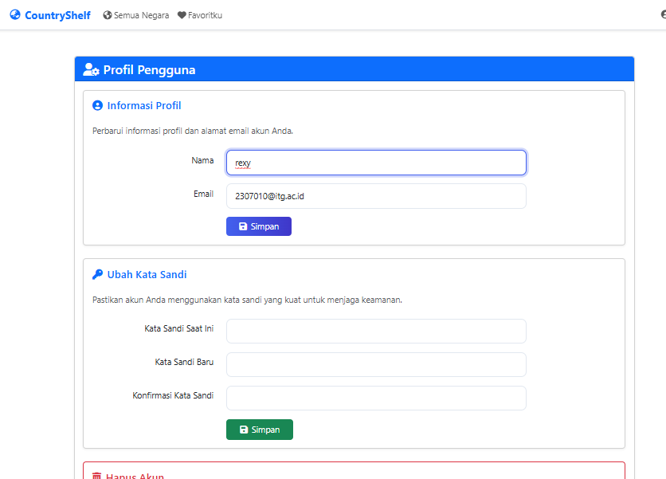

# CountryShelf - Aplikasi Koleksi Negara Favorit

## Deskripsi
CountryShelf adalah aplikasi web berbasis Laravel yang digunakan untuk menampilkan data negara di dunia dari Public API dan memungkinkan pengguna menyimpan negara favorit mereka ke dalam database lokal beserta catatan pribadi.

Aplikasi ini dirancang sebagai aplikasi multi-user, di mana setiap pengguna memiliki akun sendiri dan hanya dapat mengelola data favorit miliknya.

## Teknologi yang Digunakan
- Framework: Laravel 12
- Bahasa Pemrograman: PHP 8.3
- Database: SQLite
- Frontend: Blade Template + Bootstrap 5
- Autentikasi: Laravel Breeze (Login/Registration)
- API Client: Laravel HTTP Client
- Version Control: Git & GitHub
- Font Awesome: untuk ikon

## Sumber Data (Public API)
### Nama API
REST Countries API (https://restcountries.com/)

### Endpoint yang Digunakan
- Get All Countries: GET https://restcountries.com/v3.1/all?fields=name,capital,region,population,flags
- Get Country by Name (Search): GET https://restcountries.com/v3.1/name/{countryName}?fields=name,capital,region,population,flags

### Data yang Digunakan dari API
- Nama negara
- Bendera (SVG/PNG)
- Ibu kota
- Region
- Populasi

## Fitur-fitur
- Registrasi dan login pengguna (multi-user)
- Menampilkan daftar negara dari Public API dengan pagination (20 negara per halaman)
- Pencarian negara secara real-time
- Menyimpan negara favorit ke database lokal
- Menambahkan catatan pribadi pada negara favorit
- Mengedit dan menghapus data favorit
- Sistem isolasi data (user hanya bisa mengakses favorit miliknya sendiri)
- Tampilan responsif yang kompatibel dengan berbagai perangkat
- Tampilan dalam bahasa Indonesia

## Instalasi

### Prasyarat
- PHP >= 8.2
- Composer
- Node.js dan npm
- Web server (Apache/Nginx) opsional

### Langkah-langkah Instalasi

1. Clone repositori ini:
```bash
git clone <repository-url>
cd CountryShelf
```

2. Install dependensi PHP:
```bash
composer install
```

3. Copy file `.env.example` menjadi `.env` dan sesuaikan konfigurasi:
```bash
cp .env.example .env
```

4. Generate application key:
```bash
php artisan key:generate
```

5. Buat database SQLite (jika menggunakan SQLite):
```bash
touch database/database.sqlite
```

6. Jalankan migrasi database:
```bash
php artisan migrate
```

7. Install dependensi Node.js:
```bash
npm install
```

8. Build asset:
```bash
npm run build
```

9. Jalankan aplikasi:
```bash
php artisan serve
```

Aplikasi akan berjalan di `http://127.0.0.1:3000`

## Struktur Database
### Tabel: users
- id
- name
- email
- password
- timestamps

### Tabel: favorites
- id
- user_id (foreign key ke users)
- country_name
- capital
- region
- population
- note
- timestamps

## Screenshot Aplikasi

*Gambar 1: Tampilan dashboard aplikasi CountryShelf menampilkan daftar negara*


*Gambar 2: Halaman login aplikasi CountryShelf*


*Gambar 3: Halaman favorit menampilkan negara-negara yang disimpan pengguna*


*Gambar 4: Halaman profil pengguna untuk mengelola informasi akun*

## Kontribusi

Jika ingin berkontribusi pada proyek ini, silakan fork repositori ini dan buat pull request.

## Lisensi

Proyek ini dilisensikan di bawah lisensi MIT.

## Informasi Kontak

Nama: Rexy Surya Ramadhan
NIM: 2307010